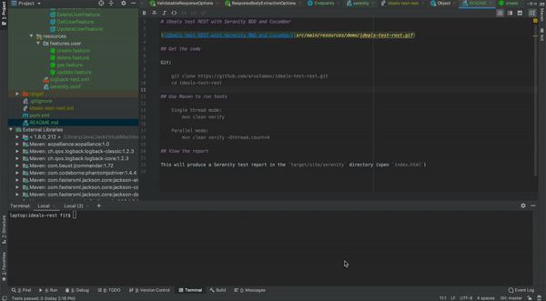

# iDeals test REST with Serenity BDD and Cucumber

## Get the code

Git:

    git clone https://github.com/arustamov/ideals-test-rest.git
    cd ideals-test-rest

## Use Maven to run tests

    Single thread mode:
        mvn clean verify

    Parallel mode:
        mvn clean verify -Dthread.count=4

## View the report

This will produce a Serenity test report in the `target/site/serenity` directory (open `index.html`)
